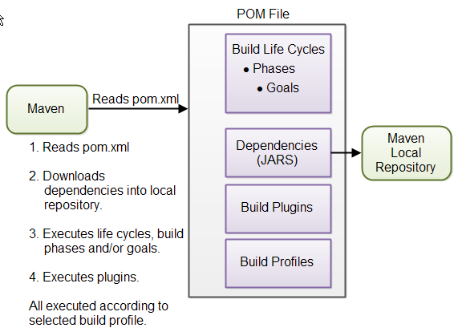

<style>
img {
  display: block;
  margin: 0 auto;
}
</style>


# Java高级程序设计

## 自动构建

> 工欲善其事，必先利其器


---

## 自动构建 Build automation

Build automation is the process of automating the creation of a software build and the associated processes including: compiling computer source code into binary code, packaging binary code, and running automated tests.

-- Wikipedia<!-- .element align="right" -->

---

# [Make](http://www.ruanyifeng.com/blog/2015/02/make.html)
假设a.txt来源于合并b.txt 和c.txt
``` bash
$ cat b.txt c.txt > a.txt
```
可以定义一个Makefile

``` makefile
a.txt: b.txt c.txt
    cat b.txt c.txt > a.txt
```
``` bash
$ make a.txt
```

---

# Makefile

A makefile is a special file that lists a set of rules for compiling a project. These rules include targets, which can be an action `make` needs to take (eg. "clean" or "build") or the files/objects make will need to build (eg. .o files or an executable), and the commands that need to be run in order to build that target. When you call the program `make`, it runs through each of these targets in your Makefile and executes them.

```makefile
target: dependencies
       steps to build target with dependencies
```


---
`hellomake.c` / `hellofunc.c` / `hellomake.h` 

```c
#include <hellomake.h>
int main() {
    myPrintHelloMake(); 
    return(0);
}
```

```c
#include <stdio.h>
#include <hellofunc.h>
void myPrintHelloMake(void) {
    printf("Hello, Hacker Schoolers!\n"); 
    return;
}
```
```c
void myPrintHelloMake(void);
```


---

# Makefile -v1
```makefile

hellomake: hellomake.c hellofunc.c
     gcc -o hellomake hellomake.c hellofunc.c -I.

clean:
	rm -f *.o hellomake

```

<small>https://cs.colby.edu/maxwell/courses/tutorials/maketutor/</small>

---
# Makefile -v2

``` makefile

CC=gcc
CFLAGS=-I.

hellomake: hellomake.o hellofunc.o
     $(CC) -o hellomake hellomake.o hellofunc.o

clean:
	rm -f *.o hellomake


```

---

# Makefile -v3
```makefile
CC=gcc
CFLAGS=-I.
DEPS = hellomake.h

# $@ is the left side of the :
# the $< is the first item in the dependencies list
%.o: %.c $(DEPS)
	$(CC) -c -o $@ $< $(CFLAGS)

hellomake: hellomake.o hellofunc.o 
	$(CC) -o hellomake hellomake.o hellofunc.o 

clean:
	rm -f *.o hellomake 
```

---

# Makefile -v4

```makefile
CC=gcc
CFLAGS=-I.
DEPS = hellomake.h
OBJ = hellomake.o hellofunc.o 

%.o: %.c $(DEPS)
	$(CC) -c -o $@ $< $(CFLAGS)

# $@ and $^  are the left and right sides of the :, respectively,
hellomake: $(OBJ)
	$(CC) -o $@ $^ $(CFLAGS)

.PHONY: clean
clean:
	rm -f *.o hellomake
```
---

# 构建工具

- Make
- Rake
- Cake
- MS build
- Ant
- Gradle

---

# Apache Maven

Apache Maven is a software project management and comprehension tool. Based on the concept of a project object model (POM), Maven can manage a project's build, reporting and documentation from a central piece of information.

https://maven.apache.org/


---

# Project object model (POM)

 ```xml
 <project xmlns="http://maven.apache.org/POM/4.0.0" 
            xmlns:xsi="http://www.w3.org/2001/XMLSchema-instance"
            xsi:schemaLocation="http://maven.apache.org/POM/4.0.0
                                http://maven.apache.org/xsd/maven-4.0.0.xsd">
    <modelVersion>4.0.0</modelVersion>
    <groupId>cn.edu.nju</groupId>
    <artifactId>hello-world</artifactId>
    <version>1.0.0</version>

    <properties>
        <maven.compiler.source>1.8</maven.compiler.source>
        <maven.compiler.target>1.8</maven.compiler.target>
    </properties>
</project>
```

---

# 目录结构


```
my-app
|-- pom.xml
`-- src
    |-- main
    |   `-- java
    |       `-- com
    |           `-- mycompany
    |               `-- app
    |                   `-- App.java
    `-- test
        `-- java
            `-- com
                `-- mycompany
                    `-- app
                        `-- AppTest.java
```

---

# HelloWorld.java

```java
package helloworld;

public class HelloWorld {
	public static void main(String args[]){
		System.out.println("Hello World, Maven");
	}
}
```

```shell
mvn package 
```

What does `mvn pakcage` mean?

---

# Maven Phases

- **validate**: validate the project is correct and all necessary information is available
- **compile**: compile the source code of the project
- **test**: test the compiled source code using a suitable unit testing framework. These tests should not require the code be packaged or deployed
- **package**: take the compiled code and package it in its distributable format, such as a JAR.

---
## Maven Phases Continued
- **integration-test**: process and deploy the package if necessary into an environment where integration tests can be run
- **verify**: run any checks to verify the package is valid and meets quality criteria
- **install**: install the package into the local repository, for use as a dependency in other projects locally
- **deploy**: done in an integration or release environment, copies the final package to the remote repository for sharing with other developers and projects.

---

## 还是那个Math

```java
package helloworld;

public class Math {
    /**
     * 阶乘
     *
     * @param n
     * @return
     */
    public int factorial(int n) throws Exception {
        if (n < 0) {
            throw new Exception("负数没有阶乘");
        } else if (n <= 1) {
            return 1;
        } else {
            return n * factorial(n - 1);
        }
    }

    /**
     * 斐波那契数列
     *
     * @param n
     * @return
     */
    public int fibonacci(int n) throws Exception {
        if (n <= 0) {
            throw new Exception("斐波那契数列从第1位开始");
        } else if (n == 1) {
            return 0;
        } else if (n == 2) {
            return 1;
        } else {
            return fibonacci(n - 1) + fibonacci(n - 2);
        }
    }

}

``` 

---

## 还是那个MathTest
```java
package helloworld;

import org.junit.Test;
import static org.junit.Assert.*;

public class MathTest {
    @Test
    public void fibonacci() throws Exception {
        assertEquals(21, new Math().fibonacci(9));
    }

    @Test
    public void testFactorial() throws Exception {
        assertEquals(120, new Math().factorial(5));
    }
}
```

---

## 需要JUnit怎么办？

```xml
 <project xmlns="http://maven.apache.org/POM/4.0.0" 
            xmlns:xsi="http://www.w3.org/2001/XMLSchema-instance"
            xsi:schemaLocation="http://maven.apache.org/POM/4.0.0 http://maven.apache.org/xsd/maven-4.0.0.xsd">
    <modelVersion>4.0.0</modelVersion>
    <groupId>cn.edu.nju</groupId>
    <artifactId>hello-world</artifactId>
    <version>1.0.0</version>
    <properties>
        <maven.compiler.source>1.8</maven.compiler.source>
        <maven.compiler.target>1.8</maven.compiler.target>
    </properties>

    <dependencies>
        <dependency>
            <groupId>junit</groupId>
            <artifactId>junit</artifactId>
            <version>4.13.1</version>
        </dependency>
    </dependencies>
</project>
```

---
<small>`mvn test`</small>

```
$ mvn test   
[INFO] Scanning for projects...
[INFO] 
[INFO] -----------------------< cn.edu.nju:hello-world >-----------------------
[INFO] Building hello-world 1.0.0
[INFO] --------------------------------[ jar ]---------------------------------
Downloading from central: https://repo.maven.apache.org/maven2/junit/junit/4.13.1/junit-4.13.1.pom
Downloaded from central: https://repo.maven.apache.org/maven2/junit/junit/4.13.1/junit-4.13.1.pom (25 kB at 11 kB/s)
Downloading from central: https://repo.maven.apache.org/maven2/junit/junit/4.13.1/junit-4.13.1.jar
Downloaded from central: https://repo.maven.apache.org/maven2/junit/junit/4.13.1/junit-4.13.1.jar (383 kB at 14 kB/s)
...
-------------------------------------------------------
 T E S T S
-------------------------------------------------------
Running helloworld.MathTest
Tests run: 2, Failures: 0, Errors: 0, Skipped: 0, Time elapsed: 0.053 sec
Results :
Tests run: 2, Failures: 0, Errors: 0, Skipped: 0
[INFO] ------------------------------------------------------------------------
[INFO] BUILD SUCCESS
[INFO] ------------------------------------------------------------------------
[INFO] Total time:  30.498 s
[INFO] Finished at: 2020-11-15T15:50:36+08:00
[INFO] ------------------------------------------------------------------------
```
---


# Maven Concepts



- POM Files
- Build Life Cycles, Phases and Goals
- Dependencies and Repositories
- Build Plugins
- Build Profiles

---

# Maven POM Files

A Maven POM file (Project Object Model) is an XML file that describe the resources of the project. This includes the directories where the source code, test source etc. is located in, what external dependencies (JAR files) your projects has etc.


The POM file describes what to build, but most often not how to build it. How to build it is up to the Maven build phases and goals. You can insert custom actions (goals) into the Maven build phase if you need to, though.


---

# POM inheritance

```xml
<project xmlns="http://maven.apache.org/POM/4.0.0"
         xmlns:xsi="http://www.w3.org/2001/XMLSchema-instance"
         xsi:schemaLocation="http://maven.apache.org/POM/4.0.0
                      http://maven.apache.org/xsd/maven-4.0.0.xsd">
    <modelVersion>4.0.0</modelVersion>
    
        <parent>
        <groupId>org.codehaus.mojo</groupId>
        <artifactId>my-parent</artifactId>
        <version>2.0</version>
        <relativePath>../my-parent</relativePath>
        </parent>
    

    <artifactId>my-project</artifactId>
    ...
</project>
```


---

# Running Maven

Running Maven is done by executing the mvn command from a command prompt. When executing the mvn command you pass the name of a **build life cycle**, **phase** or **goal** to it.

``` bash
mvn install
```

<small>This command executes the build phase called install (part of the default build life cycle), which builds the project and copies the packaged JAR file into the local Maven repository. Actually, this command executes all build phases before install in the build phase sequence, before executing the install build phase.</small>

---

# Build Life Cycles, Phases and Goals

Maven contains three major build life cycles:

- clean
- default
- site

Inside each build life cycle there are build phases, and inside each build phase there are build goals.


---

# Executing

You can execute either a build life cycle, build phase or build goal. When executing a build life cycle you execute all build phases (and thus build goals) inside that build life cycle.

When executing a build phase you execute all build goals within that build phase. Maven also executes all build phases earlier in the build life cycle of the desired build phase.


``` sh
mvn clean
mvn clean install
```


---

#  Default Life Cycle

The default life cycle is the build life cycle which generates, compiles, packages etc. your source code.

You cannot execute the default build life cycle directly, as is possible with the clean and site. Instead you have to execute a specific build phase within the default build life cycle.

---

| Build Phase | Description                                                                                                                                            |
| ----------- | ------------------------------------------------------------------------------------------------------------------------------------------------------ |
| validate    | <small>Validates that the project is correct and all necessary information is available. This also makes sure the dependencies are downloaded.</small> |
| compile     | <small>Compiles the source code of the project.</small>                                                                                                |
| test        | <small>Runs the tests against the compiled source code using a suitable unit testing framework. </small>                                               |
| package     | <small>Packs the compiled code in its distributable format, such as a JAR.</small>                                                                     |
| install     | <small>Install the package into the local repository.</small>                                                                                          |
| deploy      | <small>Copies the final package to the remote repository for sharing.</small>                                                                          |

---

# Project Dependencies

<small>Your project may need external Java APIs or frameworks which are packaged in their own JAR files to be on the classpath when you compile your project code. Each external JAR may again also need other external JAR files etc. Downloading all these dependencies (JAR files) recursively downloaded is cumbersome.</small> 

<small>Maven has built-in dependency management. You specify in the POM file what external libraries your project depends on, and which version, and then Maven downloads them for you and puts them in your local Maven repository. If any of these external libraries need other libraries, then these other libraries are also downloaded into your local Maven repository.</small>


---

##### Dependencies

``` xml
<project xmlns="http://maven.apache.org/POM/4.0.0"
         xmlns:xsi="http://www.w3.org/2001/XMLSchema-instance"
         xsi:schemaLocation="http://maven.apache.org/POM/4.0.0 http://maven.apache.org/xsd/maven-4.0.0.xsd">
    <modelVersion>4.0.0</modelVersion>
    <groupId>com.jenkov.crawler</groupId>
    <artifactId>java-web-crawler</artifactId>
    <version>1.0.0</version>
      <dependencies>
        <dependency>
          <groupId>org.jsoup</groupId>
          <artifactId>jsoup</artifactId>
          <version>1.7.1</version>
        </dependency>
        <dependency>
          <groupId>junit</groupId>
          <artifactId>junit</artifactId>
          <version>4.8.1</version>
          <scope>test</scope>
        </dependency>
      </dependencies>
</project>
```

---

# Repositories


---

# Maven Plugins

Maven plugins enable you to add actions to the build process.
```xml
<build>
  <plugins>
    <plugin>
      <groupId>org.apache.maven.plugins</groupId>
      <artifactId>maven-compiler-plugin</artifactId>
      <version>3.6.1</version>
      <configuration>
        <source>1.8</source>
        <target>1.8</target>
      </configuration>
    </plugin>
  </plugins>
</build>
```
---

# A tutorial

Building Java Projects with Maven 

https://spring.io/guides/gs/maven/

```sh
git clone https://github.com/spring-guides/gs-maven.git
```

---

# A web application

Serving Web Content with Spring MVC

https://spring.io/guides/gs/serving-web-content/

```sh
git clone https://github.com/spring-guides/gs-serving-web-content.git
```

``` sh
mvn spring-boot:run
```
---

# 作业

自动构建你的葫芦娃


---

