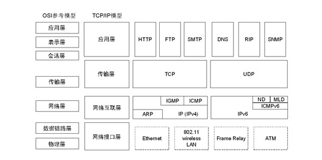
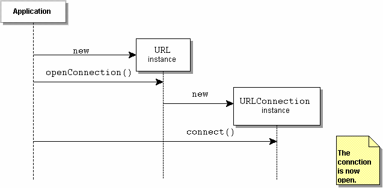
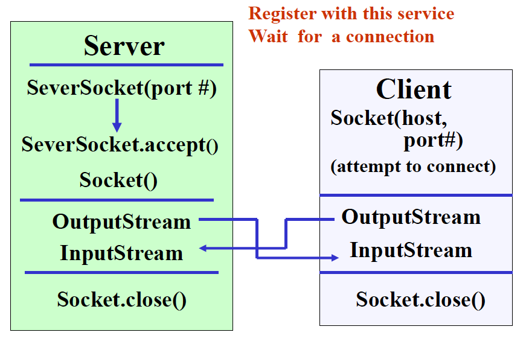
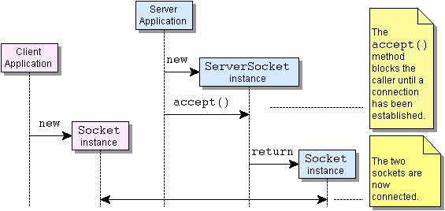
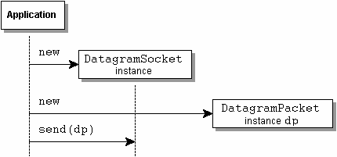

<style>
img {
  display: block;
  margin: 0 auto;
}
pre, 
code{
  overflow-y: auto;
  max-height: 450px;
}
</style>


# Java高级程序设计

## 网络编程

<br>

<small>https://docs.oracle.com/javase/tutorial/networking/index.html</small>
<small>https://docs.oracle.com/javase/8/docs/technotes/guides/net/index.html</small>

---

## java.net


- 标准Java包
  + java.net.URL
  + java.net.URLConnection
  + java.net.InetAddress
  + java.net.ServerSocket
  + java.net.Socket
  + java.net.DatagramSocket
  + java.net.DatagramPacket

---

## Networking Basics




---

## Networking Basics

- TCP (Transmission Control Protocol) 
  + TCP is a connection-based protocol that provides a reliable flow of data between two computers.

- UDP (User Datagram Protocol) 
  + UDP is a protocol that sends independent packets of data, called datagrams, from one computer to another with no guarantees about arrival. UDP is not connection-based like TCP.

---

## Networking Basics

- Port
  + The TCP and UDP protocols use ports to map incoming data to a particular process running on a computer.
  + 0-65535

- Networking Classes in the JDK
  + URL, URLConnection, Socket, and ServerSocket
  + DatagramPacket, DatagramSocket, and MulticastSocket

---

## URL

- URL is the acronym for Uniform Resource Locator. It is a reference (an address) to a resource on the Internet. 

- A URL takes the form of a string that describes how to find a resource on the Internet. URLs have two main components: the protocol needed to access the resource and the location of the resource.
  + Protocol: HTTP, FTP, Gopher, File, News...
  + Resource name: Host Name; File Name; Port Number; Reference

---

## URLConnection



---

## An Example

- Read from an URL

```java
import java.net.*;
import java.io.*;
public class URLConnectionReader {
    public static void main(String[] args) throws Exception {
        URL oracle = new URL("http://www.oracle.com/");
        BufferedReader in = new BufferedReader(new InputStreamReader(oracle.openStream()));
        String inputLine;
        while ((inputLine = in.readLine()) != null) 
            System.out.println(inputLine);
        in.close();
    }
}
```
---

## An Example

- Connecting to a URL

```java
try {
    URL myURL = new URL("http://example.com/");
    URLConnection myURLConnection = myURL.openConnection();
    myURLConnection.connect();
    Map<String, List<String>> headers = myURLConnection.getHeaderFields();
    for (Map.Entry<String, List<String>> entry: headers.entrySet()){
        String key = entry.getKey();
        for (String value: entry.getValue()) 
          System.out.println(key + ":"+ value);
    }
} 
catch (MalformedURLException e) { 
    // new URL() failed
} 
catch (IOException e) {   
    // openConnection() failed
}
```

---

## An Example

- Read from an URLConnection

```java
import java.net.*;
import java.io.*;
public class URLConnectionReader {
    public static void main(String[] args) throws Exception {
        URL oracle = new URL("http://www.oracle.com/");
        URLConnection yc = oracle.openConnection();
        BufferedReader in = new BufferedReader(new InputStreamReader(yc.getInputStream()));
        String inputLine;
        while ((inputLine = in.readLine()) != null) 
            System.out.println(inputLine);
        in.close();
    }
}
```

---

## Socket

- Socket
  + A socket is one endpoint of a two-way communication link between two programs running on the network. A socket is bound to a port number so that the TCP layer can identify the application that data is destined to be sent to.
  + Usage: <code>java.net.Socket</code>; <code>java.net.ServerSocket</code>

- URLs are relatively high-level connection to the Web.

---

## Example

- Server

```java
public class EchoServer {
    public static void main(String[] args) throws IOException {         
        int portNumber = Integer.parseInt(args[0]);
        try (
            ServerSocket serverSocket =
                new ServerSocket(Integer.parseInt(args[0]));
            Socket clientSocket = serverSocket.accept();     
            PrintWriter out =
                new PrintWriter(clientSocket.getOutputStream(), true);                   
            BufferedReader in = new BufferedReader(
                new InputStreamReader(clientSocket.getInputStream()));
        ) {
            String inputLine;
            while ((inputLine = in.readLine()) != null) {
                out.println(inputLine);
            }
        } catch (IOException e) {
            System.out.println("Exception caught when trying to listen on port "
                + portNumber + " or listening for a connection");
            System.out.println(e.getMessage());
        }
    }
}
```

---

## Example

- Server-side programming
  + Create a server socket and a common socket
  + Enable the server socket listen
  + Create an input stream and output steam for this common socket
  + Read from the input stream or write to the output stream.
  + Close all objects

---

## Example

- Client

```java
public class EchoClient {
    public static void main(String[] args) throws IOException {        
        String hostName = args[0];
        int portNumber = Integer.parseInt(args[1]);
        try (
            Socket echoSocket = new Socket(hostName, portNumber);
            PrintWriter out =
                new PrintWriter(echoSocket.getOutputStream(), true);
            BufferedReader in =
                new BufferedReader(
                    new InputStreamReader(echoSocket.getInputStream()));
            BufferedReader stdIn =
                new BufferedReader(
                    new InputStreamReader(System.in))
        ) {
            String userInput;
            while ((userInput = stdIn.readLine()) != null) {
                out.println(userInput);
                System.out.println("echo: " + in.readLine());
            }
        } catch (UnknownHostException e) {
            System.err.println("Don't know about host " + hostName);
            System.exit(1);
        } catch (IOException e) {
            System.err.println("Couldn't get I/O for the connection to " +
                hostName);
            System.exit(1);
        } 
    }
}

```

---

##  Example

- Client-side programming
  + Open a socket.
  + Open an input stream and output stream to the socket.
  + Read from and write to the stream according to the server's protocol.
  + Close the streams.
  + Close the socket.

---

## Connection-oriented programming



---

## Connection-oriented programming



---

## Support multiple clients

```java
while (true) {
    //accept a connection;
    //create a thread to deal with the client;
}
```

<span style="color:#0099ff">Multi-thread!</span>

---

## Datagram

- Datagram
  + A datagram is an independent, self-contained message sent over the network whose arrival, arrival time, and content are not guaranteed.
  + The delivery of datagrams to their destinations is not guaranteed. Nor is the order of their arrival.

---

## Example

- Server

```java
import java.io.*;

public class QuoteServer {
    public static void main(String[] args) throws IOException {
        new QuoteServerThread().start();
    }
}
```

---

## Example

- Server

```java
public class QuoteServerThread extends Thread {
    protected DatagramSocket socket = null;
    protected BufferedReader in = null;
    protected boolean moreQuotes = true;
    public QuoteServerThread() throws IOException {
	      this("QuoteServerThread");
    }
    public QuoteServerThread(String name) throws IOException {
        super(name);
        socket = new DatagramSocket(4445);
        try {
            in = new BufferedReader(new FileReader("one-liners.txt"));
        } catch (FileNotFoundException e) {
            System.err.println("Could not open quote file. Serving time instead.");
        }
    }
    public void run() {
        while (moreQuotes) {
            try {
                byte[] buf = new byte[256];
                DatagramPacket packet = new DatagramPacket(buf, buf.length);
                socket.receive(packet);
                String dString = null;
                if (in == null)
                    dString = new Date().toString();
                else
                    dString = getNextQuote();
                buf = dString.getBytes();
                InetAddress address = packet.getAddress();
                int port = packet.getPort();
                packet = new DatagramPacket(buf, buf.length, address, port);
                socket.send(packet);
            } catch (IOException e) {
                e.printStackTrace();
		        moreQuotes = false;
            }
        }
        socket.close();
    }
    protected String getNextQuote() {
        String returnValue = null;
        try {
            if ((returnValue = in.readLine()) == null) {
                in.close();
		        moreQuotes = false;
                returnValue = "No more quotes. Goodbye.";
            }
        } catch (IOException e) {
            returnValue = "IOException occurred in server.";
        }
        return returnValue;
    }
}
```

---

## Example

- Client 

```java
public class QuoteClient {
    public static void main(String[] args) throws IOException {
        DatagramSocket socket = new DatagramSocket();
        byte[] buf = new byte[256];
        InetAddress address = InetAddress.getByName(args[0]);
        DatagramPacket packet = new DatagramPacket(buf, buf.length, address, 4445);
        socket.send(packet);
        packet = new DatagramPacket(buf, buf.length);
        socket.receive(packet);
        String received = new String(packet.getData(), 0, packet.getLength());
        System.out.println("Quote of the Moment: " + received);
        socket.close();
    }
}

```

---

## Datagram Packets via UDP




---

## Broadcasting

```java
MulticastSocket socket = new MulticastSocket(4446);
InetAddress group = InetAddress.getByName("203.0.113.0");
socket.joinGroup(group);

DatagramPacket packet;
for (int i = 0; i < 5; i++) {
    byte[] buf = new byte[256];
    packet = new DatagramPacket(buf, buf.length);
    socket.receive(packet);

    String received = new String(packet.getData());
    System.out.println("Quote of the Moment: " + received);
}

socket.leaveGroup(group);
socket.close();

```

---

## HTTP Client APIs

- Old Package: com.oracle.httpclient
- Goal: a Java based framework for communication with Web Services.
- Package from Java 9/10: jdk.incubator.http
- New Package from Java 11: java.net.http

---

## HTTP Client and WebSocket APIs

- Provides high-level client interfaces to HTTP (versions 1.1 and 2) and low-level client interfaces to WebSocket. The main types defined are:
  + HttpClient
  + HttpRequest
  + HttpResponse
  + WebSocket

---

## HTTP Client

- Synchronous example

```java
HttpClient client = HttpClient.newHttpClient();
HttpRequest request = HttpRequest.newBuilder()
                      .uri(URI.create("https://www.baidu.com"))
HttpResponse<String> response = client.send(request,  HttpResponse.BodyHandlers.ofString());               
System.out.println(response.body());  
```

---

## HTTP Client

- Asynchronous example

```java
HttpClient client = HttpClient.newHttpClient();
HttpRequest request = HttpRequest.newBuilder()
                      .uri(URI.create("https://www.baidu.com"))
                      .build();               
CompletableFuture<String> result = client.sendAsync(request, HttpResponse.BodyHandlers.ofString())
                                   .thenApply(HttpResponse::body);
System.out.println(result.get());  
```

---

## HTTP/2

```java
HttpClient.newBuilder()
          .followRedirects(HttpClient.Redirect.NEVER)
          .version(HttpClient.Version.HTTP_2)
          .build()
          .sendAsync(HttpRequest.newBuilder()
          .uri(new URI("https://http2.akamai.com/demo"))
          .GET()
          .build(),
          HttpResponse.BodyHandlers.ofString())
          .whenComplete((resp,t) -> {
            if(t != null){
               t.printStackTrace();
            }else{
                    System.out.println(resp.version());
                    System.out.println(resp.statusCode());
                  }
            }).join();  
```
---

## WebSocket

```java
HttpClient client = HttpClient.newHttpClient();
WebSocket webSocket = client.newWebSocketBuilder()
                        .buildAsync(URI.create("ws://localhost:8080/echo"), new WebSocket.Listener() {
                      
   @Override
   public CompletionStage<?> onText(WebSocket webSocket, CharSequence data, boolean last) {
      // request one more
      webSocket.request(1);
      // Print the message when it's available
      return CompletableFuture.completedFuture(data)
                            .thenAccept(System.out::println);
      }
   }).join();
webSocket.sendText("hello ", false);
webSocket.sendText("world ",true);
TimeUnit.SECONDS.sleep(10);
webSocket.sendClose(WebSocket.NORMAL_CLOSURE, "ok").join(); 
```
---

## Blocking vs Unblocking

- BIO (Blocking IO): 同步阻塞
  + <small>同步并阻塞，服务器实现模式为一个连接一个线程，即客户端有连接请求时服务器端就需要启动一个线程进行处理。</small>

- NIO (Unblocking/New IO): 同步非阻塞
  + <small>当一个连接创建后，不需要对应一个线程，这个连接会被注册到多路复用器上面，所以所有的连接只需要一个线程就可以搞定，当这个线程中的多路复用器进行轮询的时候，发现连接上有请求的话，才开启一个线程进行处理，也就是一个请求一个线程模式。</small>

---

## Blocking vs Unblocking

- AIO (Asynchronous IO): 异步非阻塞
  + read/write方法都是异步的，完成后会主动调用回调函数。
  + <code>AsynchronousSocketChannel</code> ,<code>AsynchronousServerSocketChannel</code>,<code>AsynchronousFileChannel</code>,<code>AsynchronousDatagramChannel</code>


---

<!-- _class: lead -->
## 让葫芦娃和妖精们联网战斗吧！

---

