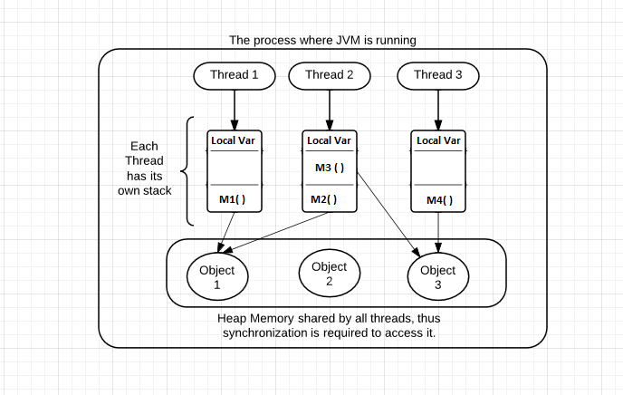

<style>
img {
  display: block;
  margin: 0 auto;
}
pre {
  display: block;
  position: relative;
  width: 100%;
  margin: 20px auto;
  text-align: left;
  font-size: 28px;
  line-height: 28px;
  word-wrap: break-word;
  box-shadow: 0px 0px 6px rgba(0, 0, 0, 0.3); 
} 
code{
  text-transform: none; 
}
pre code {
  display: block;
  padding: 5px;
  overflow: auto;
  max-height: 420px;
  word-wrap: normal; 
}
</style>


# Java高级程序设计

## 并发编程

<br/>

<small>https://docs.oracle.com/javase/tutorial/essential/concurrency/index.html</small>


---

## 并发

> The world is concurrent.
<div align="right"> —— Joe Armstrong</div> 


> Concurrency occurs when two or more execution flows are able to run simultaneously.

<div align="right"> —— Edsger Wybe Dijkstra </div> 


---

## 进程 vs. 线程

- 进程：是系统进行资源分配和调度的一个独立单位，也是一个具有独立功能的程序；
- 线程：线程依托于进程而存在，是CPU调度和分派的基本单位，它是比进程更小的能独立运行的基本单位。线程自己基本上不拥有系统资源，只拥有一点在运行中必不可少的资源(如程序计数器、一组寄存器和栈)，但是它可与同属一个进程的其他的线程共享进程所拥有的全部资源。

---

## 进程 vs. 线程


<small>区别在于，进程属于资源分配的单位，而线程则是作业调度的单位；进程拥有自己的地址空间，而多个线程拥有自己的堆栈和局部变量，并共享所依托于进程的资源。</small>

---

## 多线程的意义

- 多进程操作的意义在于多个进程轮流共享CPU的时间片(针对单处理器情形，多处理器可理解为并行)，属于并发操作。
- 多线程的并发操作优势在于当程序遇到阻塞的情形。当程序的某个任务因外部条件问题，导致阻塞，如果没有并发，则整个程序停止，直到外部条件发生变化，使用并发后，程序中的其他任务还可以继续执行，如果没有阻塞，在单处理器上考虑多线程并发也就没有意义了，线程之间的切换会造成大量的时间消耗。


---

## 并发 vs 并行


---


## JVM Threads



---

## Java 并发机制

- 内置并发机制：对线程的直接支持

- 并发对象模型：不纯粹的Active Object模型
  + 同时存在 “主动”对象 和 “被动”对象

- Java 1.5+
  + java.util.concurrent.*

---

## 接触过多线程程序了吗？


```java
public class QuoteServerThread extends Thread {
    protected DatagramSocket socket = null;
    protected BufferedReader in = null;
    protected boolean moreQuotes = true;
    public QuoteServerThread() throws IOException {
	      this("QuoteServerThread");
    }
    public QuoteServerThread(String name) throws IOException {
        super(name);
        socket = new DatagramSocket(4445);
        try {
            in = new BufferedReader(new FileReader("one-liners.txt"));
        } catch (FileNotFoundException e) {
            System.err.println("Could not open quote file. Serving time instead.");
        }
    }
    public void run() {
        //to do something;
    }
}
```

---

## 接触过多线程程序了吗？

```java
public class QuoteServer {
    public static void main(String[] args) throws IOException {
        new QuoteServerThread().start();
    }
}
```

还有Java NIO：
- 由一个专门的线程(Selector)来处理所有的IO事件，并负责分发。
- 事件驱动机制：事件到的时候触发，而不是同步的去监视事件。
- 线程通讯：线程之间通过 wait,notify 等方式通讯。保证每次上下文切换都是有意义的。减少无谓的线程切换。

---

## 创建线程

- 实现Runnable接口
- 继承Thread

---

## Runnable

<code>java.lang.Runnable</code>

``` java
public interface Runnable {
    public abstract void run();
}

public class LiftOff implements Runnable {
    protected int countDown = 10; // Default
    private static int taskCount = 0;
    private final int id = taskCount++;
    public LiftOff() {
    }
    public LiftOff(int countDown) {
        this.countDown = countDown;
    }
    public String status() {
        return "#" + id + "(" +
                (countDown > 0 ? countDown : "Liftoff!") + "), ";
    }
    public void run() {
        while (countDown-- > 0) {
            System.out.print(status());
            Thread.yield(); //后面解释
        }
    }
}
```
---

## Runnable

<code>java.lang.Runnable</code>

``` java
public class MainThread {
    public static void main(String[] args) {
        LiftOff launch = new LiftOff();
        launch.run(); //is it a thread?
    }
}
```

<small>`Runnable`接口仅仅定义“任务”</small>

 ```java
 Runnable r = () -> { task code };
 ```

---

## Thread

<code>java.lang.Thread</code>

``` java
public class BasicThreads {
    public static void main(String[] args) {
        //把任务装进线程里
        Thread t = new Thread(new LiftOff());
        t.start();
        System.out.println("Waiting for LiftOff");
    }
}
```

<small>`Thread`对象像是运载火箭，`Runnable`的实现对象就是一个荷载（payload）</small>

---

## 或者

``` java
public class SimpleThread extends Thread {
    private int countDown = 5;
    private static int threadCount = 0;
    public SimpleThread() {
        super(Integer.toString(++threadCount));
        start();
    }
    public String toString() {
        return "#" + getName() + "(" + countDown + "), ";
    }
    public void run() {
        while (true) {
            System.out.print(this);
            if (--countDown == 0)
                return;
        }
    }
    public static void main(String[] args) {
        for (int i = 0; i < 5; i++)
            new SimpleThread();
    }
}
```

---

## WARNING

- 实际上<code>public class Thread implements Runnable</code>

- The run() method should not be called directly by the application. The system calls it.

- If the run() method is called explicitly by the application then the code is executed sequentially not concurrently.

---

## 多线程，走起

```java
public class MoreBasicThreads {
    public static void main(String[] args) {
        for (int i = 0; i < 5; i++)
            new Thread(new LiftOff()).start();
        System.out.println("Waiting for LiftOff");
    }
}
```

直接启动多个<font color=red>Thread</font>


---

## 或者用ExecutorService启动

``` java
public class CachedThreadPool {
    public static void main(String[] args) {
        ExecutorService exec = Executors.newCachedThreadPool();
        for (int i = 0; i < 5; i++)
            exec.execute(new LiftOff());
        exec.shutdown();
    }
}
```
<small>`CachedThreadPool`：根据需要创建新线程的线程池，如果现有线程没有可用的，则创建一个新线程并添加到池中，如果有被使用完但是还没销毁的线程，就复用该线程</small>

---

## 线程池？

- 在面向对象编程中，创建和销毁对象是很费时间的，因为创建一个对象要获取内存资源或者其它更多资源。
- 在Java中更是如此，虚拟机将试图跟踪每一个对象，以便能够在对象销毁后进行垃圾回收。
- 所以提高服务程序效率的一个手段就是尽可能减少创建和销毁对象的次数，特别是一些很耗资源的对象创建和销毁。
- 如何利用已有对象来服务就是一个需要解决的关键问题，其实这就是一些"池化资源"技术产生的原因。

---

## 或者另一种策略

``` java
public class FixedThreadPool {
    public static void main(String[] args) {
        // Constructor argument is number of threads:
        ExecutorService exec = Executors.newFixedThreadPool(5);
        for (int i = 0; i < 5; i++)
            exec.execute(new LiftOff());
        exec.shutdown();
    }
}
```
<small>创建一个固定线程数的线程池，在任何时候最多只有n个线程被创建。如果在所有线程都处于活动状态时，有其他任务提交，他们将等待队列中直到线程可用。如果任何线程由于执行过程中的故障而终止，将会有一个新线程取代这个线程执行后续任务。</small>

---

## 问题

- 如果需要获得异步执行的任务结果怎么办？

`Callable<V>`：封装异步运行的任务，有返回值
``` java
public interface Callable<V> {
    V call() throws Exception;
}
```

`Future<V>`：保存异步计算的结果
```java
V get() //阻塞，直到计算完成
V get(long timeout, TImeUnit unit)
void cancel(boolean mayInterrupt)
boolean isCancelled()
boolean isDone()
```

---

## 例子

```java
class TaskWithResult implements Callable<String> {
    private int id;
    public TaskWithResult(int id) {
        this.id = id;
    }
    public String call() {
        return "result of TaskWithResult " + id;
    }
}
```

---

## 例子

```java
public class CallableDemo {
    public static void main(String[] args) {
        ExecutorService exec = Executors.newCachedThreadPool();
        ArrayList<Future<String>> results = new ArrayList<Future<String>>();
        for (int i = 0; i < 10; i++)
            results.add(exec.submit(new TaskWithResult(i)));
        for (Future<String> fs : results)
            try {
                // get() blocks until completion:
                System.out.println(fs.get());
            } catch (InterruptedException e) {
                System.out.println(e);
                return;
            } catch (ExecutionException e) {
                System.out.println(e);
            } finally {
                exec.shutdown();
            }
    }
}
```


---

## Callable

``` java
class MyCallable implements Callable<String>{
    @Override
    public String call() throws Exception {
        System.out.println("做一些耗时的任务...");
        Thread.sleep(5000);
        return "OK";
    }
}
```

---

## Future

```java
public class FutureSimpleDemo {
    public static void main(String[] args) throws InterruptedException, ExecutionException {
        ExecutorService executorService = Executors.newCachedThreadPool();
        Future<String> future = executorService.submit(new MyCallable());
        System.out.println("do something...");
        System.out.println("得到异步任务返回结果：" + future.get());
        System.out.println("Completed!");
    }
}
```

<small>当调用`Future`的`get()`方法以获得结果时，当前线程就开始阻塞，直接`call()`方法结束返回结果。</small>

---

## 线程池常见用法

- 调用`Executors`类的静态方法`newCachedThreadPool`或者`newFixedThreadPool`
- 调用`submit`提交`Runnalbe`或`Callable`对象
- 保存好返回的`Future`对象，以便得到结果或者取消任务
- 当不想再提交任何任务时，调用`shutdown`

---

## Sleep 睡眠

- suspend execution for a specified period

``` java
public class SleepingTask extends LiftOff {
    public void run() {
        try {
            while (countDown-- > 0) {
                System.out.print(status());
                // Old-style: Thread.sleep(100);
                TimeUnit.MILLISECONDS.sleep(100);
            }
        } catch (InterruptedException e) {
            System.err.println("Interrupted");  //可能被打断
        }
    }
```
---

```java
    public static void main(String[] args) {
        ExecutorService exec = Executors.newCachedThreadPool();
        for (int i = 0; i < 5; i++)
            exec.execute(new SleepingTask());
        exec.shutdown();
    }
}
```

<small>运行结果看起来很均衡，但实际并不完全如此...跟`yield()`语义不一样</small> 


---

## Yield 让位 

- `yield`和`sleep`的主要区别：
  + <small>yield方法会临时暂停当前正在执行的线程，来让有同样优先级的正在等待的线程有机会执行</small>
  + <small>如果没有正在等待的线程，或者所有正在等待的线程的优先级都比较低，那么该线程会继续运行</small>
  + <small>执行了yield方法的线程什么时候会继续运行由线程调度器来决定，不同的厂商可能有不同的行为</small>
  + <small>yield方法不保证当前的线程会暂停或者停止，但是可以保证当前线程在调用yield方法时会放弃CPU</small>


---

## Priority 优先级

``` java
public class SimplePriorities implements Runnable {
    private int countDown = 5;
    private volatile double d; // No optimization 后面再解释
    private int priority;
    public SimplePriorities(int priority) {
        this.priority = priority;
    }
    public void run() {
        Thread.currentThread().setPriority(priority);
        while (true) {
            // An expensive, interruptable operation:
            for (int i = 1; i < 100000; i++) {
                d += (Math.PI + Math.E) / (double) i;
                if (i % 1000 == 0)
                    Thread.yield();
            }
            System.out.println(this);
            if (--countDown == 0) return;
        }
    }
```

---

```java    
    public String toString() {
        return Thread.currentThread() + ": " + countDown;
    }

    public static void main(String[] args) {
        ExecutorService exec = Executors.newCachedThreadPool();
        for (int i = 0; i < 5; i++)
            exec.execute(
                    new SimplePriorities(Thread.MIN_PRIORITY));
        exec.execute(
                new SimplePriorities(Thread.MAX_PRIORITY));
        exec.shutdown();
    }
}
```

改变线程优先级这件事可以做，但尽量不要做

---

## Daemon 线程

``` java
public class SimpleDaemons implements Runnable {
    public void run() {
        try {
            while (true) {
                TimeUnit.MILLISECONDS.sleep(100);
                print(Thread.currentThread() + " " + this);
            }
        } catch (InterruptedException e) {
            print("sleep() interrupted");
        }
    }
```
---

```java
    public static void main(String[] args) throws Exception {
        for (int i = 0; i < 10; i++) {
            Thread daemon = new Thread(new SimpleDaemons());
            daemon.setDaemon(true); // Must call before start()
            daemon.start();
        }
        System.out.println("All daemons started");
        TimeUnit.MILLISECONDS.sleep(99);
    }
}
```

后台运行线程，当所有非后台线程结束时，应用退出，所有Daemon线程被杀！

---

## Thread Identification

- The identity of the currently running thread can be found using the <font color="red">currentThread</font> method.
- This has a static modifier, which means that there is only one method for all instances of Thread objects.
- The method can always be called using the <font color="red">Thread</font> class.
  +  `public static Thread currentThread()`;


---

## 线程是否结束？

-  `final boolean isAlive()`  //很少用到
-  `final void join() throws InterruptedException`  //等待所调用线程结束，即某个线程在另一个线程t上调用t.join()，此线程将被挂起，直到目标线程t结束才恢复
- `final void join(long millis) throws InterruptedException` //等待一个线程指定毫秒数后再消亡

---

## Join

``` java
public class ScanDouyin extends Thread{
    private int scanTime; // 浏览抖音的时长
    public ScanDouyin(String name, int scanTime){
        super(name);
        scanTime = this.scanTime;
    }
    @Override
    public void run() {
        System.out.println(getName() + ":开始刷抖音了");
        try {       
            sleep(scanTime);// 刷抖音的时间
        } catch (InterruptedException e) {
            e.printStackTrace();
        }
        System.out.println(getName() +":抖音刷完了，睡觉吧");
    }
}
```

---

## Join

```java
public class ReadySleep extends Thread{
    private ScanDouyin scanDouyin;
    public ReadySleep(String name,ScanDouyin scanDouyin){
        super(name);
        this.scanDouyin = scanDouyin;
    }
    @Override
    public void run() {
        System.out.println(getName() + ":准备开始睡觉啦");
        try {
            scanDouyin.join(); // 睡前刷把抖音 
            //睡觉的线程必须等待直到刷完抖音（刷抖音线程执行完毕，线程消亡），才能开始睡觉。    
            System.out.println("开始睡觉");
            sleep(100);
        } catch (InterruptedException e) {
            e.printStackTrace();
        }
        System.out.println(getName() + ":zzzzzzzz,已经睡着了");
    }

    public static void main(String[] args) {
        ScanDouyin scanDouyin = new ScanDouyin("刷抖音线程",10000);
        ReadySleep readySleep = new ReadySleep("睡觉线程",scanDouyin);
        readySleep.start();
        scanDouyin.start();
    }
}
```

---

## 线程生命周期


---

## 小结

- Java关于线程编程的抽象

  + Thread对象像是运载火箭，Runnable的实现对象就是一个荷载（payload）
  + Runnable/Callable --> Task 
  + Thread --> let tasks go 

---

## 资源共享问题

- 一个葫芦娃在战场上可以随意走，多个葫芦娃在战场上是随意走，那就会撞头。

- 因为一个空间位置，是不能共享的。

---

## View of OO System

- System = objects + activities

---

## Object-centric view

- A system is a collection of interconnected objects. But it is a structured collection, not a random object soup. Objects cluster together in groups, thus forming larger components and subsystems.

---

## Activity-centric view

- A system is a collection of possibly concurrent activities. 
- One logical activity may involve many threads. At a higher level, some of these activities represent system-wide use cases. 


---

## Correctness

- Safety (object-centric):
  + “Nothing bad ever happens to an object.”
  + Safety failure lead to unintended behavior at run time — things just start going wrong.

---

## Correctness

- Liveness (activity-centric): 
  + “Something eventually happens within an activity.”
  + Liveness failures lead to no behavior — things just stop running. 
  + In live systems, every activity eventually progresses toward completion; every invoked method eventually executes.

---

## Liveness Failures

- Deadlock: Circular dependencies among locks

- Livelock: A continuously retried action continuously fails.

- Starvation: The JVM/OS fails ever to allocate CPU time to a thread. 

- ...


---

## Strategies

- Immutability

- Synchronization

- Confinement

---

## 例如：单例模式

```java
public class LazySingleton {
	private static LazySingleton instance = null;
	protected LazySingleton(){
		System.out.println("Singleton's consturct method is invoked. " +
				"This method should not be public");
	}
	//is it thread-safe? how to?
	public static LazySingleton getInstance(){
		if (instance == null){
			instance = new LazySingleton();
		}
		return instance;
	}
	public void operation(){
		System.out.println("LazySignleton.operation() is executed");
	}
}
```

---

## 解决方法

- 对资源加锁，使得对资源的访问顺序化，确保在某一时刻只有一个任务在使用共享资源（使其互斥）
  + ***synchronized***
  + ***ReentrantLock***

- Mutual Exclusion （Mutex）

---

## Synchronized

``` java
public class ThreadSafeSingleton {
	private static ThreadSafeSingleton instance = null;
	protected ThreadSafeSingleton(){
		System.out.println("Singleton's consturct method is invoked. " +
				"This method should not be public");
	}
	public static synchronized ThreadSafeSingleton getInstance(){
		if (instance == null){
			instance = new ThreadSafeSingleton()
		}
		return instance;
	}
	public void operation(){
		System.out.println("ThreadSafeSingleton.operation() is executed");
	}
}
```

---

## Lock

- ReentrantLock：具有可重入、可中断、可限时、公平锁等特点。

- lock.tryLock(2, TimeUnit.SECONDS) //可限时锁，参数为时间和单位

- 如果失败做其他处理

```java
ReentrantLock lock = new ReentrantLock();
lock.lock();
try {
     //critical section
 }finally {
     lock.unlock(); //make sure the lock is unlocked even if an exception is thrown
 }
```

---

## Synchronized vs ReentrantLock

| synchronized | Reentrantlock |
|  ----------  | ------------  |
| 使用Object本身的wait、notify、notifyAll调度机制 | 与Condition结合进行线程的调度 |
| 显式的使用在同步方法或者同步代码块 | 显式的声明指定起始和结束位置 |
| 托管给JVM执行，不会因为异常、或者未释放而发生死锁 | 手动释放锁 |


---

## Critical Sections 临界区

```java
synchronized(syncObject){
    //balabala
}
```


```java
//double-check locking
public static ThreadSafeSingleton getInstance(){
		if (instance == null){
			synchronized (ThreadSafeSingleton.class){
				if(instance == null){
					instance = new ThreadSafeSingleton();		
				}
			}
		}
		return instance;
	}
```

---

## volatile

> 如果写一个变量，而这个变量接下来可能会被另一个线程读取，或者，如果读一个变量，而这个变量可能已经被另一个线程写入值，那么必须使用同步。      
<div align = right> -- Brian Goetz </div>

- <small>***volatile*** 关键字为实例字段的同步访问提供了一种免锁机制。如果声明一个字段为volatile，那么编译器和虚拟机就知道该字段可能被另一个线程并发更新。更确切地说，对volatile变量的每次读操作都会直接从计算机的主存中读取，而不是从CPU缓存中读取；同样，每次对volatile变量的写操作都会直接写入到主存中，而不仅仅写入到CPU缓存里。 </small>


---

## Thread local Storage


- 目的：把共享数据的可见范围限制在同一线程之内，这样无须同步也能保证线程之间不出现数据的争用问题。

--- 

## Thread local Storage

- `java.lang.ThreadLocal`：实现线程本地存储的功能。

- 每个线程的Thread对象中都有一个ThreadLocalMap对象，这个对象存储了一组以TreadLocal.threadLocalHashCode为键，以本地线程变量为值的K-V值对，每一个ThreadLocal对象都包含了一个独一无二的threadLocalHashCode值，使用这个值就可以在线程K-V值对中找到对应的本地线程变量。

---
## 示例

``` java
public class TestThreadLocal {
    private static final ThreadLocal<Integer> value = new ThreadLocal<Integer>() {
        @Override
        protected Integer initialValue() {
            return 0;
        }
    };
    public static void main(String[] args) {
        for (int i = 0; i < 5; i++) {
            new Thread(new TestThread(i)).start();
        }
    }
    static class TestThread implements Runnable {
        private int index;
        public TestThread(int index) {
            this.index = index;
        }
        public void run() {
            System.out.println("线程" + index + "的累加前:" + value.get());
            for (int i = 0; i < 5; i++) {
                value.set(value.get() + i);
            }
            System.out.println("线程" + index + "的累加后:" + value.get());
        }
    }
}
```
<small>各个线程的value值是相互独立的，本线程的累加操作不会影响到其他线程的值。</small>

---

## 从竞争到协作

- `wait()`;
- `notify()`;
- `notifyAll()`;

<font color=red>Object</font>类型上的三个方法

---

## Java Concurrency Models

- `wait()`: 调用某个对象的wait()方法能让当前线程阻塞，并且当前线程必须拥有此对象的monitor(即锁)；
- `notify()`: 调用某个对象的notify()方法能够唤醒一个正在等待这个对象的monitor的线程，如果有多个线程都在等待这个对象的monitor，则只能唤醒其中一个线程；
- `notifyAll()`: 调用notifyAll()方法能够唤醒所有正在等待这个对象的monitor的线程。
- ***notify*** and ***notifyAll*** have no effect if no threads are suspended on the condition variable


---

## 还是看个例子

`Message`：线程将会使用它并调用wait和notify方法。
```java
public class Message {
    private String msg;

    public Message(String str){
        this.msg=str;
    }

    public String getMsg() {
        return msg;
    }

    public void setMsg(String str) {
        this.msg=str;
    }

}
```

---

`Waiter`：等待其它的线程调用notify方法以唤醒线程完成处理。注意等待线程必须通过加synchronized同步锁拥有Message对象的监视器。

```java
public class Waiter implements Runnable{
    private Message msg;
    public Waiter(Message m){
        this.msg=m;
    }
    @Override
    public void run() {
        String name = Thread.currentThread().getName();
        synchronized (msg) {
            try{
                System.out.println(name+" waiting to get notified at time:"+System.currentTimeMillis());
                msg.wait();
            }catch(InterruptedException e){
                e.printStackTrace();
            }
            System.out.println(name+" waiter thread got notified at time:"+System.currentTimeMillis());
            //process the message now
            System.out.println(name+" processed: "+msg.getMsg());
        }
    }
}
```

---

`Notifier`：处理Message对象并调用notify方法唤醒等待Message对象的线程。注意synchronized代码块被用于持有Message对象的监视器。

```java
public class Notifier implements Runnable {
    private Message msg;
    public Notifier(Message msg) {
        this.msg = msg;
    }
    @Override
    public void run() {
        String name = Thread.currentThread().getName();
        System.out.println(name+" started");
        try {
            Thread.sleep(1000);
            synchronized (msg) {
                msg.setMsg(name+" Notifier work done");
                //msg.notify();  //只能唤醒一个Waiter线程
                msg.notifyAll();  //可以唤醒所有的Waiter线程
            }
        } catch (InterruptedException e) {
            e.printStackTrace();
        }
    }
}
```

---

`WaitNotifyTest`：交付创建多个等待线程和一个通过线程，并启动这些线程。
```java
public class WaitNotifyTest {
    public static void main(String[] args) {
        Message msg = new Message("process it");
        Waiter waiter1 = new Waiter(msg);
        new Thread(waiter1,"waiter1").start();
        Waiter waiter2 = new Waiter(msg);
        new Thread(waiter2, "waiter2").start();
        Notifier notifier = new Notifier(msg);
        new Thread(notifier, "notifier").start();
        System.out.println("All the threads are started");
    }
}
```

---

## 再看一下线程状态


---

## wait和sleep的区别

- 调用wait方法时，线程在等待的时候会释放掉它所获得的monitor，但是调用Thread.sleep()方法时，线程在等待的时候仍然会持有monitor或者锁，wait方法应在同步代码块中调用，但是sleep方法不需要
- Thread.sleep()方法是一个静态方法，作用在当前线程上；但是wait方法是一个实例方法，并且只能在其他线程调用本实例的notify()方法时被唤醒
- 如果需要暂停线程一段特定的时间就使用sleep()方法，如果要实现线程间通信就使用wait()方法。

---

## 高级设施 

java.util.concurrent.*

- CountDownLatch
- CyclicBarrier
- DelayQueue
- PriorityBlockingQueue
- ScheduledExecutorService
- Semaphore
- Exchanger

---

## 推荐


---

<!-- _class: lead -->
## 让你的葫芦娃们抖动起来！

---

