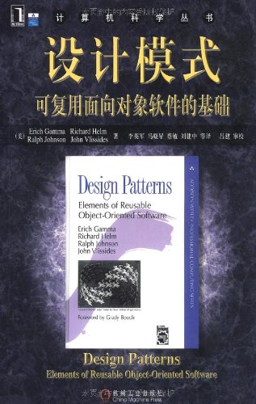
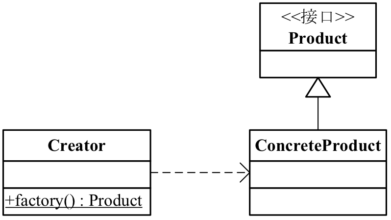
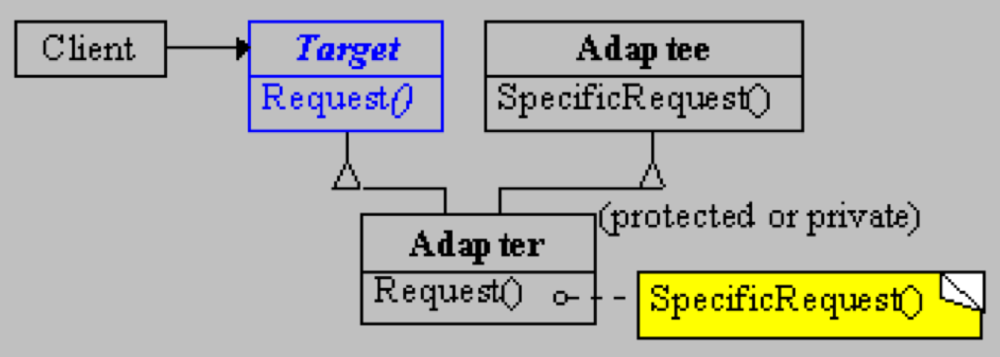
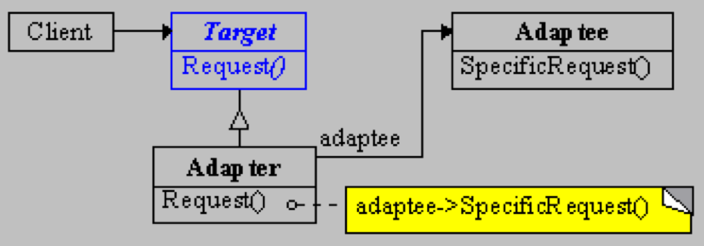
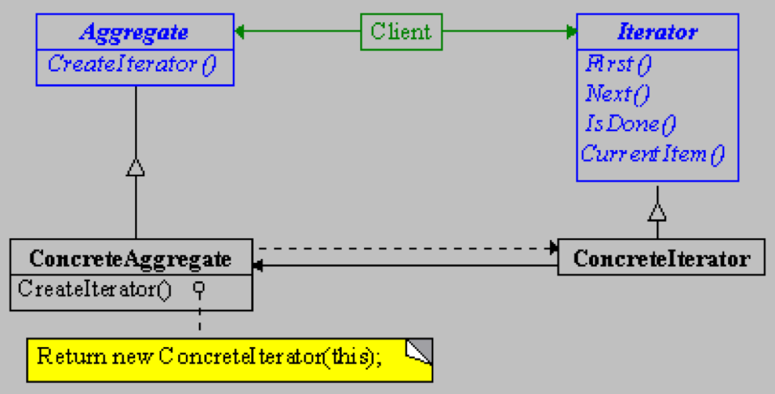
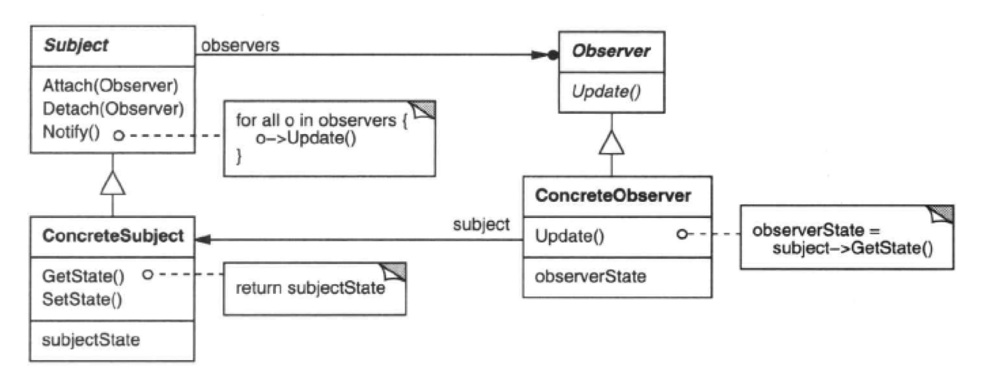
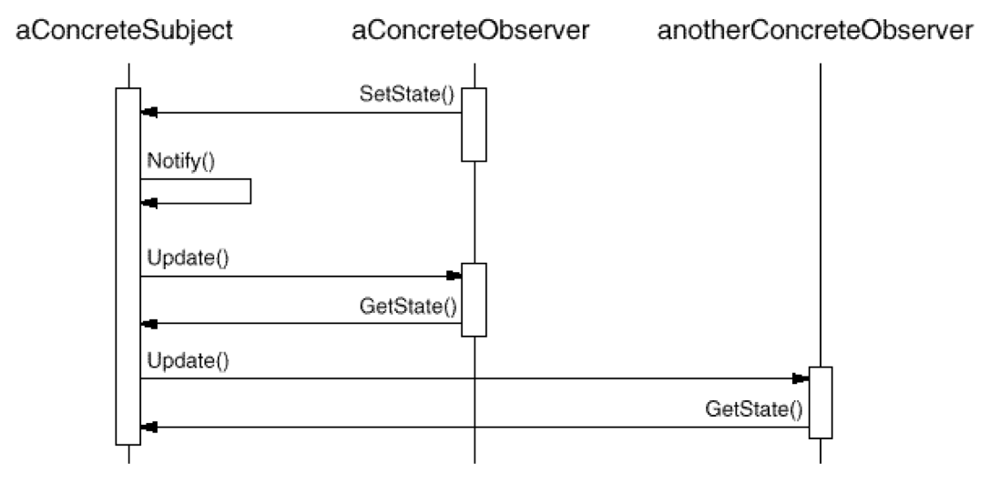
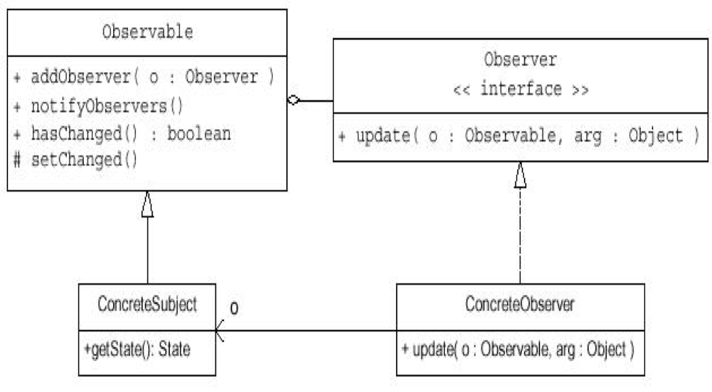

<style>
img {
  display: block;
  margin: 0 auto;
}
pre {
  display: block;
  position: relative;
  width: 100%;
  margin: 20px auto;
  text-align: left;
  font-size: 32px;
  line-height: 32px;
  word-wrap: break-word;
  box-shadow: 0px 0px 6px rgba(0, 0, 0, 0.3); 
} 
code{
  text-transform: none; 
}
pre code {
  display: block;
  padding: 5px;
  overflow: auto;
  max-height: 420px;
  word-wrap: normal; 
}
</style>


# Java高级程序设计

## 设计模式

<small>模式是某外在环境下，对特定问题的惯用解决方案。</small>


---

## 回顾设计原则

- SRP：单一职责原则
- OCP：开放-封闭原则
- LSP：Liskov替换法则
- ISP：接口隔离原则
- DIP：依赖倒置原则
- CARP：合成/聚合复用原则
- LoD：最少知识原则

---

## 原则 vs. 模式

- 模式都最大化地遵循这些原则
- 通过原则、策略“推导”出模式

---

## Design Pattern: Why?

- 直接目的：满足对优秀、简单而且可重用的解决方案的需要
  + 掌握解决反复出现的问题的办法
  + 沟通的手段（设计词汇，文档）

- 从这些实践证明是成功的设计中学习“设计”
  + 反复阅读/反复应用/反复揣摩

---

## Design Pattern: What?


> <small>Each pattern describes a problem which occurs over and over again in our environment and then describes the core of the solution to that problem, in such a way that you can use this solution a million times over, without ever doing it the same way twice.</small> 
<div align=right><small> -- Christopher Alexander: A Pattern Language</small></div>

<br>

<div style="color:#0099ff" align=center>模式本质上是设计经验的文档化。</div>


---

## Design Pattern: What?

<small>Gamma, Erich, R. Helm, R. Johnson, and J. Vlissides. **Design patterns: Elements of Reusable Object-Oriented Software**. Addison-Wesley, 1994.</small>



---

## Design Pattern: What?

- In the book **Design Patterns**, the design patterns are descriptions of communicating objects and classes that are customized to solve a general design problem in a particular context.
- Design patterns represent solutions to problems that arise when developing software within a particular context.

<div style="color:#0099ff" align=center>目标是提高代码的可复用性、可读性和可靠性</div>

---

## 基本要素

- 模式名称
- 问题
- 解决方案
- 效果

---

## 指导模式设计的三个概念

- 复用是目标
  + 两种重要的复用手段：Inheritance & Composition

- 接口与实现分离
  + 接口保持不变，分离带来灵活性
  + 多态性（polymorphism）

- 解耦
  + 降低复杂性

---

## 遇到过哪些设计模式了？

- Java Collection Framework

```java
public interface Iterator<E>{
      boolean hasNext();
      <E> next();
      void remove();
}
```
<span style="color:#0099ff">这是迭代器模式</span>

---

## 遇到过哪些设计模式了？

- Java IO

```java
BufferedReader stdin = new BufferedReader(new InputStreamReader(System.in));
PrinterWriter out = new PrintWriter(new BufferedWriter(new FileWriter("demo.out")));
```
<span style="color:#0099ff">这是装饰器模式</span>

---

## 遇到过哪些设计模式了？

- Java GUI

```java
Panel center = new Panel();
center.setLayout(new BorderLayout());
center.add(new Button("south"), BorderLayout.SOUTH);
...
```
<span style="color:#0099ff">这是组合模式</span>


---

## 遇到过哪些设计模式了？

- Java GUI

```java
class Terminator extends WindowAdapter {
  public void windowClosing (WindowEvent e) {
    system.exit(0);
  }
}
```
<span style="color:#0099ff">这是默认适配器模式</span>


---

## 遇到过哪些设计模式了？

- Delegation Event Model <span style="color:#0099ff">这是观察者模式</span>

```java
public class TestActionEvent {  
    public static void main(String[] args) {  
        Frame f = new Frame("Test");  
        Button b = new Button("Press me");  
        Monitor mo = new Monitor();  
        b.addActionListener(mo);  
        b.setActionCommand("GAME OVER!");
        f.add(b, BorderLayout.CENTER);  
        f.pack();  
        f.setVisible(true);  
    }  
}  
class Monitor implements ActionListener {  
    @Override  
    public void actionPerformed(ActionEvent e) {  
        System.out.println("a button has been pressed\n" + 
        "The relative info is:" + e.getActionCommand());  
    }  
} 
```

---


## 遇到过哪些设计模式了？

- JavaFX <span style="color:#0099ff">这是模版方法模式</span>

```java
public class MyApp extends Application {
    public void start(Stage stage) {
        Circle circ = new Circle(40, 40, 30);
        Group root = new Group(circ);
        Scene scene = new Scene(root, 400, 300);
        stage.setTitle("My JavaFX Application");
        stage.setScene(scene);
        stage.show();
    }
    public static void main(String[] args) {
        launch(args);
    }
}
```


---

## 模式分类

- Creational（创建型）
- Structural（结构型）
- Behavioral（行为型）

---

## 创建型设计模式

- 创建模式是对类的**实例化过程的抽象化**。
  + 怎样创建对象，创建哪些对象，如何组合和表示这些对象？
  + 创建模式描述了怎样构造和封装这些动态决定。

---

## 创建型设计模式

- Simple Factory 简单工厂
- Factory Method 工厂方法
- Abstract Factory 抽象工厂
- Builder 构造者
- Prototype 原型
- Singleton 单例

---

## 简单工厂



---

## 抽象工厂


---

## 原型

- Java 语言的构件模型直接支持Prototype模式
- java.lang.Object   根类
  + `protected Object clone()`;
- java.lang.Cloneable  接口

---

## 原型

- 实现clone操作
  + shallow copy vs. deep copy
  + Save & Load

<span style="color:#0099ff">可以使用序列化实现深拷贝</span>

---

## 单例

- 一个类<font color=red>仅有一个实例</font>，自行实例化并向整个系统提供一个访问它的全局访问点
  + 懒汉式 lazy mode
  + 饿汉式 eager mode

- 多线程使用下需要注意的问题！

---

## 懒汉式

```java
public class LazySingleton {
	private static LazySingleton instance = null;
	protected LazySingleton(){
		System.out.println("Singleton's consturct method is invoked. " +
				"This method should not be public");
	}
	//is it thread-safe? how to?
	public static LazySingleton getInstance(){
		if (instance == null){
			instance = new LazySingleton();
		}
		return instance;
	}
	public void operation(){
		System.out.println("LazySignleton.operation() is executed");
	}
}

```

---

## 饿汉式

```java
public class EagerSingleton {
	//is it thread-safe? 
    private static final EagerSingleton instance = new EagerSingleton() ;
    private EagerSingleton() {}
    public static EagerSingleton getInstance(){
        return instance ;
    }
    public void operation(){
      System.out.println("EagerSignleton.operation() is executed");
    }
}

```

---

## 线程安全

```java
public class ThreadSafeSingleton {
	private static ThreadSafeSingleton instance = null;
	protected ThreadSafeSingleton(){
		System.out.println("Singleton's consturct method is invoked. " +
				"This method should not be public");
	}
	//double-check locking
	public static ThreadSafeSingleton getInstance(){
		if (instance == null){
			synchronized (ThreadSafeSingleton.class){
				if(instance == null){
					instance = new ThreadSafeSingleton();		
				}
			}
		}
		return instance;
	}
	public void operation(){
		System.out.println("ThreadSafeSingleton.operation() is executed");
	}
}
```

---

## 结构型设计模式

- 结构模式描述如何将类或者对象结合在一起形成更大的结构
  + 类的结构模式：结构型模式使用继承机制来组合接口或实现。
  + 对象的结构模式：结构型对象模式描述了如何对一些对象进行组合，从而实现新功能的一些方法。可以在运行时刻改变对象的组合关系。

---

## 结构型设计模式

+ Adapter 适配器
+ Bridge 桥接
+ Composite 组合 
+ Decorator 装饰器
+ Facade 门面
+ Flyweight 享元 
+ Proxy 代理

---

## 适配器

- 将一个类的接口转换成客户希望的另外一个接口。<font color=red>转换匹配，重用功能!</font>
  + 类适配器
  + 对象适配器

---

## 类适配器




---

## 对象适配器




---

## 默认适配器

- 适配器模式的特例
- 缺省适配模式为一个接口提供缺省实现，这样子类型可以从这个缺省实现进行扩展，而不必从原有接口扩展。

```java
public abstract class WindowAdapter extends Object implements WindowListener, WindowStateListener, WindowFocusListener{
	public void windowClosed(WindowEvent e){}
    public void windowClosing(WindowEvent e){}
       ...
  }
```

---

## 组合模式

- 将对象组合成树形结构以表示“部分-整体”的层次结构，Composite使得用户对单个对象和组合对象的使用具有一致性。
- 本质：<font color=red>统一leaf对象和composite对象</font>

---

## 组合模式


---

## 装饰器模式

- 动态地给一个对象添加一些额外的职责


<span style="color:#0099ff">动态组合比静态继承更灵活</span>


---

## 代理模式

- 为其它对象提供一种代理以控制对这个对象的访问


---

## 代理模式

- 常见代理
  + Remote Proxy：为一个对象在不同的地址空间提供局部代表
  + Virtual Proxy：根据需要创建开销很大的对象
  + Protection Proxy：控制对原始对象的访问，用于对象应该有不同访问权限的时候
  + Smart Reference：取代了简单的指针，在访问对象时执行一些附加操作—引用计数，加锁，将第一次引用的持久对象装入内存…

---

## Java动态代理

- `java.lang.reflect.Proxy`
  + Java动态代理机制的主类，提供了一组静态方法来为一组接口动态地生成代理类机器对象
- `java.lang.reflect.InvocationHandler`
  + 调用处理器接口，它自定义了一个***invoke***方法，用于集中处理在动态代理类对象上的方法调用，通常在该方法中实现对委托类的代理访问

---

## Java动态代理

```java
// InvocationHandlerImpl 实现了 InvocationHandler 接口，并能实现方法调用从代理类到委托类的分
//派转发 其内部通常包含指向委托类实例的引用，用于真正执行分派转发过来的方法调用
InvocationHandler handler = new InvocationHandlerImpl(..); 

// 通过 Proxy 为包括 Interface 接口在内的一组接口动态创建代理类的类对象
Class clazz = Proxy.getProxyClass(classLoader, new Class[] { Interface.class, ... }); 

// 通过反射从生成的类对象获得构造函数对象
Constructor constructor = clazz.getConstructor(new Class[] { InvocationHandler.class }); 

// 通过构造函数对象创建动态代理类实例
Interface Proxy = (Interface)constructor.newInstance(new Object[] { handler }); 
```

---

## 行为型设计模式

- 行为模式是对在不同的对象之间划分责任和算法的抽象化。行为模式不仅仅是关于类和对象的，而且关注它们之间的**通信模式**。
   + 类的行为模式：使用继承关系在几个类之间分配行为 – Interpreter, Template Method
   + 对象的行为模式：使用对象的聚合来分配行为


---

## 行为型设计模式

- Chain of Responsibility 责任链
- Command 命令
- Interpreter 解释器
- Iterator 迭代器
- Mediator 中介
- Memento 备忘录

---

## 行为型设计模式

- Observer 观察者
- State 状态
- Strategy 策略 
- Template Method 模版方法
- Visitor 访问者


---

## 责任链

- 使多个对象都有机会处理请求，从而避免请求的发送者和接收者之间的耦合关系。将这些对象连成一条链，并沿着这条链传递该请求，直到有一个对象处理它为止。
- 优点
  + 降低耦合度：对象仅需知道请求会被“正确”地处理。接收者和发送者都没有对方的明确信息
  + 增强了给对象指派职责的灵活性
- 缺点：不保证被接受

---

## 责任链

- Event Bubbling
  + Java AWT 1.0

```java
public boolean action(Event event, Object obj){
   if (event.target == btnOK){ doOkBtnAction();}
   else if (event.target == btnExit) { doExitBtnAction();}
   else { return super.action(event.obj);}
   return true;
}
```

---

## 命令模式

- 将一个请求封装为一个对象，从而使你可用不同的请求对客户进行参数化
- 对请求排队或记录请求日志，以及支持**undo**和**redo**操作
- 可将多个Command装配成一个复合Command

---

## 命令模式

- 抽象出待执行的动作以参数化某对象，可以代替“回调”函数


<span style="color:#0099ff">使用aCommand将anInvoker和 aReceiver解耦</span>

---

## 迭代器模式

- 提供一种方法顺序访问一个聚合对象中各个元素, 而又不需暴露该对象的内部表示。
- 本质：<font color=red>控制访问聚合对象中的元素！</font>

---

## 迭代器模式




---

## 不同的实现

- 宽接口 VS. 窄接口
  + <font size=6>宽接口：一个聚集的接口提供了可以用来修改聚集元素的方法</font>
  + <font size=6>窄接口：一个聚集的接口没有提供修改聚集元素的方法</font>

- 白箱聚集 VS. 黑箱聚集
  + <font size=6>白箱聚集：聚集对象为所有对象提供同一个接口(宽接口)</font>
  + <font size=6>黑箱聚集：聚集对象为迭代子对象提供一个宽接口，而为其它对象提供一个窄接口。同时保证聚集对象的封装和迭代子功能的实现。</font>


---

## 观察者模式

- 也称为**publish/subscribe**
- 定义对象间的一种<font color=red>一对多</font>的依赖关系，当一个对象的状态发生改变时，所有依赖于它的对象都得到通知并被自动更新。


---

## 观察者模式




---

## 观察者模式



<span style="color:#0099ff"><small>注意：发出改变请求的Observer对象并不立即更新,而是将其推迟到它从目标得到一个通知之后。Notify不总是由目标对象调用。它也可被一个观察者或其它对象调用。</small></span>

---

## Java Observer

- `java.util.Observer` (interface)
- `java.util.Observable` (class)



---

## Java Observer

```java
import java.util.Observable;
public class Watched extends Observable {
	private String data = "";	
	public String retrieveData(){
		return data;
	}
	public void changeData(String data){
		if(!this.data.equals(data)){
			this.data = data;
			setChanged();			
		}	
		notifyObservers();
	}
}
```

---

## Java Observer

```java
import java.util.Observable;
import java.util.Observer;

public class Watcher implements Observer {
	public Watcher(Watched w){
		w.addObserver(this);
	}
	public void update(Observable obj, Object arg) {
		System.out.println("Data has been changed to "+((Watched)obj).retrieveData()+"");
	}
}
```

---

## 模版方法

- 定义一个操作中的算法的骨架，而将一些步骤延迟到子类中。
- Template Method使得<font color=red>子类可以不改变一个算法的结构即可重定义该算法的某些特定步骤。</font>

---

## 模版方法

- 类行为模式


---

## 模版方法

- 固定算法骨架

- 模板方法导致一种**反向的控制结构**

- 子类可以置换掉父类的可变部分，但是子类却不可以改变模板方法所代表的顶级逻辑！

---

## Summary


>  <small>  It is possible to make buildings by stringing together patterns, in a rather loose way. A building made like this, is an assembly of patterns. It is not dense. It is not profound. But it is also possible to put patterns together in such a way that many patterns overlap in the same physical space: the building is very dense; it has many meanings captured in a small space; and through this density, it becomes profound. </small>
    
<div align=right><small> -- Christopher Alexander: A Pattern Language [AIX+77, page xli]</small></div>


---

## Remember

> In theory practice is the same as theory. In practice it isn't. 
<div align=right> -- Adam Smith</div> 

> 纸上得来终觉浅，绝知此事要躬行。
<div align=right> -- 陆游·宋</div>


---

<!-- _class: lead -->
## 面向~~葫芦娃~~对象编程，你学~~废~~会了吗？


---

