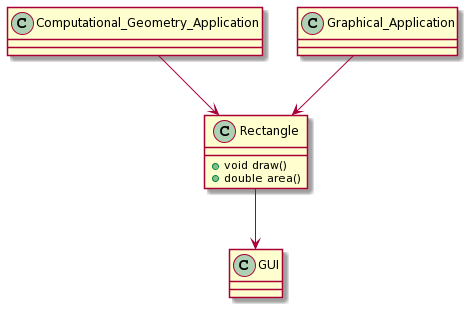
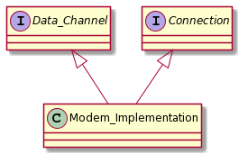
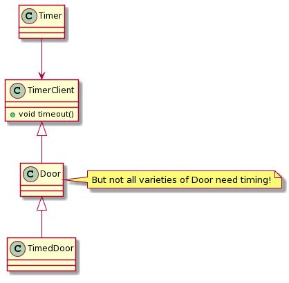
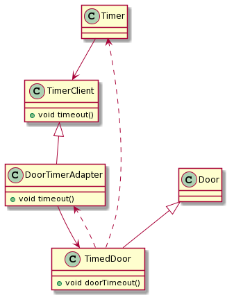
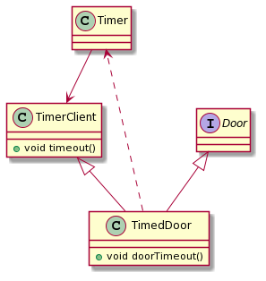
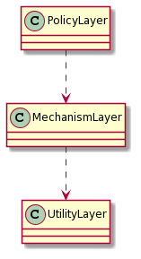
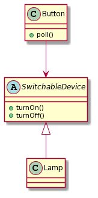

<style>
img {
  display: block;
  margin: 0 auto;
}
</style>


# Java高级程序设计


## 设计原则 

### Change is the eternal truth.

---

<br><br><br><br><br>
> 复杂性是软件开发过程中所固有的特质。
<p align="right">-- Grady Booch, 1994</p>


---

## 应对复杂性的基本途径（元方法）

- 分解   （分而治之）
- 抽象   （抓本质，抓重点）
- 层次化  （纲举目张）


<div style="color: red">面向过程 vs. 面向对象</div>

---

## 模块化

- 模块(module): “Self-Contained”; well-defined interfaces
- 模块化(modular): 软件构造为一组“模块”之有序组合，从而易于装配、易于修补替换模块。
- <font color=red>Extendibility</font> 和 <font color=red>Reusability</font> 的要求。

---

## 软件复用

- 为什么要复用？
- 复用什么？
- 复用的技术问题？


---

## 程序设计范型

- 过程抽象 --> 数据抽象
- 结构化 --> 面向对象

 <span style="color: red">软件工程发展的历史就是人们不断追求更高的抽象、封装和模块化的历史。</span>

---

## OOSC

> Object-oriented software construction is the approach to system structuring that bases the architecture of software systems on <font color=red>the types of objects </font> they manipulate — not on the function they achieve.

<p align="right">-- Bertrand Meyer</p>

<span style="color:red">But OOP == OOSC ?</span>

---

## 软件设计

- 遵循<font color=red>敏捷实践</font>去发现问题；
- 应用<font color=red>设计原则</font>去诊断问题；
- 应用适当的<font color=red>设计模式</font>去解决问题。


---

## SOLID


- SRP (The Single-Responsibility Principle)
- OCP (The Open-Closed Principle) 
- LSP (The Liskov Substitution Principle)
- ISP (The Interface-Segregation Principle) 
- DIP (The Dependency-Inversion Principle) 

---

## SRP 单一职责原则

- A class should have only one reason to change. 
- What is a Responsibility?
- An axis of change is an axis of change only if the changes actually occur.  

---

## 举个例子




---

## Applying SRP


---

## SRP Violation

<br>

```java
interface Modem{
    public void dial (String pno);
    public void hangup();
    public void send (char c);
    public char recv();
}
```

---

## Applying SRP

 

 <span style="color:#0099ff">Note：如果应用程序的变化方式总是导致这两个职责同时变化，那么就不必分离它们！</span> 

---

## OCP 开放封闭原则 

<br>

#### Software entities (classes, modules, functions, etc.) should be open for extension, but closed for modification.

<br>

<span style="color:red">OCP is the heart of OO design!</span>

---

## OCP Inside

- Two primary attributes
  + <font size=6><font color="red">Open for extension</font>: the behavior of the module can be extended.</font>
  + <font size=6><font color="red">Closed for modification</font>: extending the behavior of a module does not result in changes to the source or binary code of the module.</font>

- Do not modify source code, but change behavior.

<span style="color:red">Is it possible?</span>

---

## Abstraction is the key!


 

---

## Applying OCP


---

## Template Pattern


 <font color=#0099ff>A clear separation of generic functionality from the detailed implementation of that functionality！</font>

---

## Heuristics

- OCP是面向对象设计的核心所在！
  + 灵活性、可重用性、可维护性
  + 使用OOPL不代表遵循了OCP
  + 肆意抽象亦不是一个好主意
- 100%的封闭不可能，必须有策略地对待这个问题。
  + 对程序中呈现出频繁变化的那些部分做出抽象，拒绝不成熟的抽象和抽象本身一样重要。


---

## LSP 里氏替换法则

- Subtypes must be substitutable for their base types. 
- > If for each object ***o1*** of type ***S*** there is an object ***o2*** of type ***T*** such that for all programs ***P*** defined in terms of ***T***, the behavior of ***P*** is unchanged when ***o1*** is substituted for ***o2*** then ***S*** is a subtype of ***T***.
<p align="right">-- Barbara Liskov, 1988</p>


---

## LSP Violation (I)

- RTTI (运行时类型识别)

```java
public class Shape {
    ShapeType itsType;
    Shape(ShapeType shapeType){
        itsType = shapeType;
    }
}
```

---

## LSP Violation (I)

- RTTI (运行时类型识别)

```java
public class Circle extends Shape{
    Circle(ShapeType shapeType){
        super(shapeType);
    }
    public void draw(){
        System.out.println("Draw a circle.");
    }
}
```

---

## LSP Violation (I)

- RTTI (运行时类型识别)

```java
public class Square extends Shape{
    Square(ShapeType shapeType){
        super(shapeType);
    }
    public void draw(){
        System.out.println("Draw a square.");
    }
}
```

---

## LSP Violation (I)


```java
public class Client {
    public static void drawShape(Shape shape){
        if(shape.itsType == ShapeType.circle){
            Circle circle = (Circle)shape; circle.draw();}
        else if(shape.itsType == ShapeType.square){
            Square square = (Square)shape; square.draw();
        }}
   public static void main(String[] args){
        Shape  s1 = new Circle(ShapeType.circle);
        Shape  s2 = new Square(ShapeType.square);
        Client.drawShape(s1); Client.drawShape(s2);
    }}
```
<span style="color: red">增加一种新类型?</span>


---

## LSP Violation (II)

- incorrect IS-A Relationship


---

## LSP Violation (II)

- incorrect IS-A Relationship

```java
class Rectangle{
  double itsWidth;
  double itsHeight;
  public void setWidth(double w) {itsWidth=w;}
  public void setHeight(double h) {itsHeight=h;}
  public double area(){ return itsWidth*itsHeight;}
}
```
---

## LSP Violation (II)

- incorrect IS-A Relationship

```java
class Square extends Rectangle{
  public void setWidth(double w) {
      super.setWidth(w); super.setHeight(w);}
  public void setHeight(double h) {
      super.setWidth(w); super.setHeight(w);}
}
```

---

## LSP Violation (II)

<br/>

```java
public class Client{
    public static void main (String[] args){
        Rectangle r = new Square();
        r.SetWidth(5.0);
        r.SetHeight(4.0);
        double a = r.area();
        System.out.println(a);
    }
}
```

<span style="color:red">结果为20吗？</span>

---

## The Real Problem

- Validity is not intrinsic.

- IS-A is about Behavior 
  + Behaviorally, a ***Square*** is not a ***Rectangle***.

---

## Hueristics

- Violation 1: 
   + Degenerate functions in derivations.
   ```java
      public class Base{
          public void f(){/** some code */}
      }
      public class Derived extends Base{
          public void f(){}
      }
   ```

- Violation 2:
  + Throwing exceptions from derivatives.


---

## LSP

- LSP is one of the enablers of the OCP.
- It is the substitutability of subtypes that allows a module, expressed in terms of a base type, to be extensible without modification. 

---

## ISP 接口隔离原则

- Clients should not be forced to depend on methods that they do not use. 
- Deals with the disadvantage of “fat” interfaces – whose interfaces are not cohesive. 


---

## 来个例子

- Common Door

```java
class Door {
    public abstract void lock();
    public abstract void unlock();
    public abstract bool isDoorOpen();
}
```

---

- Timer

```java
class Timer {
    public void register (int timeout, TimerClient client );
}
```

- TimerClient

```java
class TimerClient{
    public abstract void timeout();
}
```

<span style="color:red">How about a timed door?</span> 

---

## Interface Polution



---

## Seperate Interfaces

- Solution 1: adapter




---

## Seperate Interface

- Solution 2: multiple inheritance 
  + in Java,  ***Interface***



---

## Heuristic

- 客户程序应该仅依赖于它们实际调用的方法。
- 方法：把胖类的接口分解为多个特定于客户程序的接口。
- 目标：<font color="red">高内聚，低耦合</font>

---

## DIP 依赖倒置原则

- High level modules should not depend on low-level modules. Both should depend on abstractions.

- Abstractions should not depend on details. Details should depend on abstractions.

<span style="color:red">Inversion: 相对于结构化方法而言！</span> 

---

## Laying

- <font size=6>Booch: “… all well structured OO architectures have clearly defined layers, with each layer providing some coherent set of services through a well-defined and controlled interface.”</font>



<span style="color:red">Unfortunate!</span>

---

## Laying

- Inverted Layers


---

## Hollywood Principle

- “Don’t call us, we’ll call you.” 低层模块实现了在高层模块中声明并被高层模块调用的接口。

- also an inversion of interface ownership: 客户拥有抽象接口，服务者则从这些抽象接口派生。

---

## 再来个例子


```java
public class Button{
    private Lamp itsLamp;
    public void poll(){
      if (/* some condition */)
        itsLamp.turnOn();
     }
}
```
<span style="color:red">问题：高层依赖低层！</span> 

---

## 反转


```java
public class Button{
    private ButtonServer bs;
    public void poll(){
      if (/* some condition */)
        bs.turnOn();
     }
}
```

---

## 反转



<font color="red">换个更友好的名字</font>

---

## Heuristic

- Depend on abstractions!
  + 不应该依赖于具体类——程序中所有的依赖关系都应该终止于抽象类或者接口。

---

## Heuristic

- so,
  + 任何变量都不应该持有一个指向具体类的指针或引用
  + 任何类都不应该从具体类派生
  + 任何方法都不应该覆写它的任何基类中的已经实现了的方法
  + 例外：可以依赖稳定的具体类，比如<code>String</code>


---

## DIP

- 依赖关系的倒置正是好的面向对象设计的标志所在。
- 如果程序的依赖关系是倒置的，它就是面向对象的设计，否则就是过程化的设计。
- DIP是实现许多OO技术所宣称的好处的基本低层机制。它的正确应用对于创建可重用的框架来说是必须的。

---

## CARP 合成/聚合复用原则

- Composition vs. Aggregration
   + 聚合表示“拥有”关系或者整体与部分的关系
   + 合成是一种强得多的“拥有”关系——部分和整体的生命周期是一样的。

- 换句话说：合成是值的聚合（Aggregation by Value），而一般说的聚合是引用的聚合（Aggregation by Reference）


---

## 复用

- 复用方法：
   + 合成/聚合复用：将已有对象纳入到新对象中，使之成为新对象的一部分
   + 继承

---

## 复用

- 继承的优点
   + 新类易实现
   + 易修改或扩展

- 继承的缺点
   + 继承复用破环包装，白箱复用
   + 父类发生变化，子类不得不改变 
   + 继承的实现是静态的，不能在运行时改变  

---

## 复用

- 合成/聚合的优点
  + 黑箱复用
  + 每一个新的类可以将焦点集中在一个任务上
  + 可以在运行时动态进行
- 缺点：系统中会有较多的对象需要管理

---

## 复用原则

- 优先使用对象合成/聚合，而不是继承
- 利用合成/聚合可以在运行时动态配置组件的功能，并防止类层次规模的爆炸性增长
- <font color="red">区分HAS-A 和 IS-A</font>

---

## Coad法则

- 只有“Is-A”关系才符合继承关系，“Has-A”关系应当用聚合来描述。
- 永远不会出现需要将子类换成另外一个类的子类的情况。
- 子类具有扩展父类的责任，而不是具有置换掉（override）或注销掉（nullify）父类的责任。
- 只有在分类学角度上有意义时，才可以使用继承。不要从工具类继承。


---

## LoD （Law of Demeter）迪米特法则/最少知识原则

- Only talk to your immediate friends
- Don't talk to strangers 


---

## LoD

- LoD的本质是信息隐藏

  + <font size=6> 在类的划分上，应当创建有弱耦合的类。类之间的耦合越弱，就越有利于复用。</font>
  + <font size=6> 在类的结构设计上，每一个类都应当尽量降低成员的访问权限。一个类不应当public自己的属性，而应当提供取值和赋值的方法让外界间接访问自己的属性。</font>
  + <font size=6> 在类的设计上，只要有可能，一个类应当设计成<font color="red">不变类</font>。</font>
  + <font size=6> 在对其它对象的引用上，一个类对其它对象的引用应该降到最低。</font>

---

## OOSC

> Object-oriented software construction is the construction of software systems as <font color=red>structured collections</font> of possibly partial <font color=red>abstract data type </font> implementations.
<p align="right"> -- Bertrand Meyer</p>

---

## Design Principles

- <font size=6>SRP (The Single-Responsibility Principle) 单一职责原则</font>
- <font size=6>OCP (The Open-Closed Principle) 开放-封闭原则</font>
- <font size=6>LSP (The Liskov Substitution Principle) Liskov替换原则</font>
- <font size=6>ISP (The Interface-Segregation Principle) 接口隔离原则</font>
- <font size=6>DIP (The Dependency-Inversion Principle) 依赖倒置原则</font>
- <font size=6>CARP (Composition/Aggregation Reuse Principle) 合成/聚合复用原则</font>
- <font size=6>LoD (Law of Demeter) 迪米特法则</font>

---

<!-- _class: lead -->

## 你的葫芦娃违规了吗？

---
<!-- _class: lead -->
## Let's Embrace Change.

---

