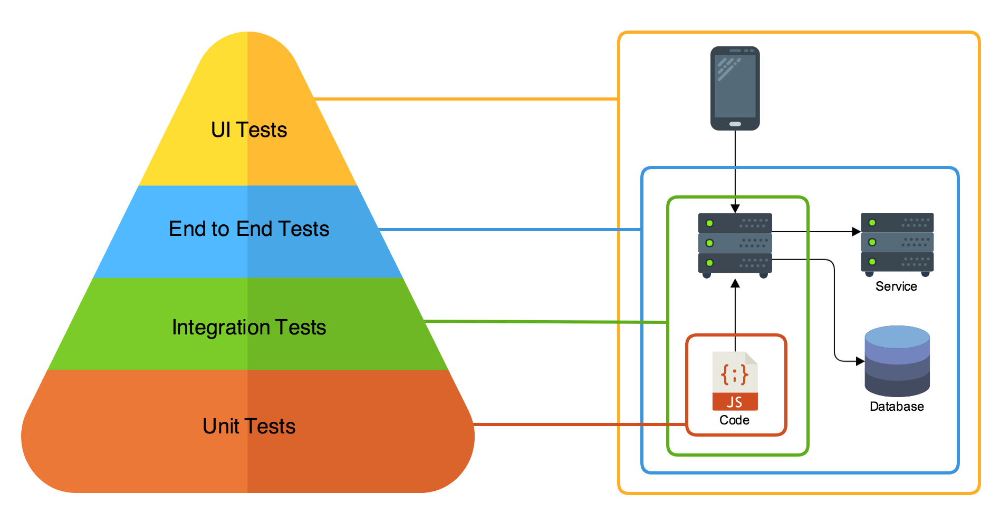
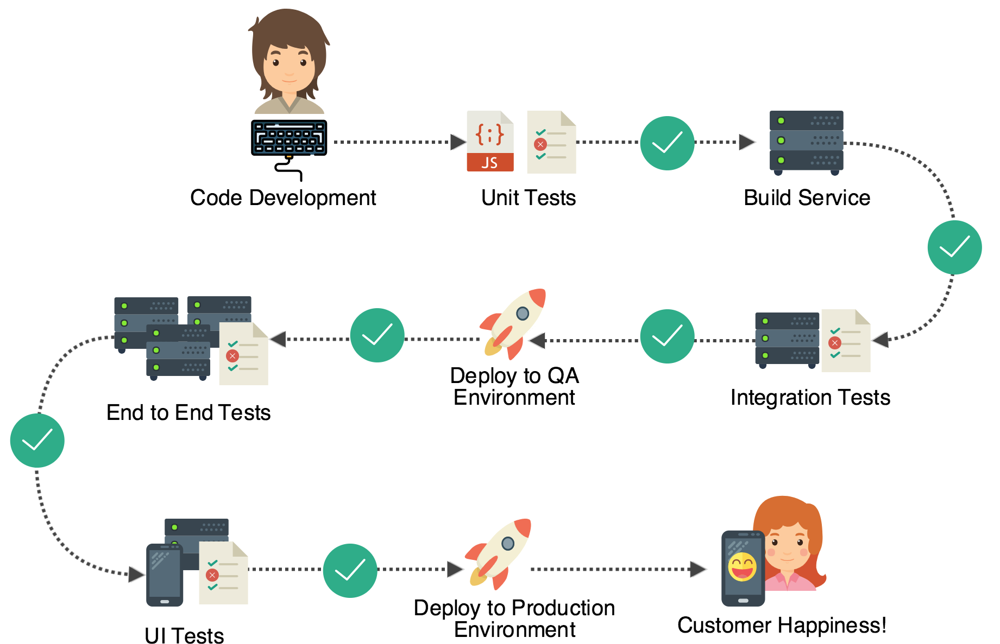

<style>
img {
  display: block;
  margin: 0 auto;
}
</style>


# Java高级程序设计

## 测试

---


## 软件测试

“使用人工和自动手段来运行或测试某个系统的过程，其目的在于检验它是否满足规定的需求或弄清楚预期结果与实际结果之间的差别。”





---

## 测试过程

 

在软件开发中是一个很重要的方面，良好的测试可以在很大程度决定一个应用的命运。

---

## 单元测试 

单元测试中的“单元”在Java中可以理解为某个类中的某一个方法，因此“单元测试”就是针对Java中某个类中的某一个方法中的逻辑代码进行验证即测试该方法是不是可以正常工作。 


---

## 为什么需要进行单元测试

- 单元测试的测试相对于集成测试的测试成本较低
- 提高开发效率
- 提升项目工程代码质量
- 快速定位Bug

---

## 如何进行单元测试

- 第三方测试工具（框架）
  - JUnit
  - TestNG
  - Spock
  - ...

测试本身不是Java语言层面的内容


---

## JUnit


#### [Download and Install](https://github.com/junit-team/junit4/wiki/Download-and-Install)

##### Plain-old JAR
Download the following JARs and add them to your test classpath:

- [junit.jar](https://search.maven.org/search?q=g:junit%20AND%20a:junit)
- [hamcrest-core.jar](https://search.maven.org/artifact/org.hamcrest/hamcrest-core/1.3/jar)

##### Maven

Next time...


---

## 简单示例

```java
public class Math {
    /**
     * 阶乘
     * @param n
     * @return
     */
    public int factorial(int n) throws Exception {
        if (n < 0) {
            throw new Exception("负数没有阶乘");
        } else if (n <= 1) {
            return 1;
        } else {
            return n * factorial(n - 1);
        }
    }

}
```

如何验证`factorial()`是对的？

---


## 编写一个“测试类”

``` java
import org.junit.Test;
import static org.junit.Assert.*;

public class MathTest {
    @Test
    public void testFactorial() throws Exception {
        assertEquals(120, new Math().factorial(5));
    }
}

```

```bash
java -cp ... org.junit.runner.JUnitCore MathTest
```
---

## 在IDE中写测试用例


Keeps the bar <span style="color:green">green</span> to keep the code clean


---

## 解释

- 导入了`org.junit.Test`和`org.junit.Assert.*`，后者是静态导入
- `testFactorial`是在要测试的方法名`factorial`前加个`test`
- 所有测试方法返回类型必须为void且无参数。
- 一个测试方法之所以是个测试方法是因为`@Test`这个注解
- `assertEquals`的作用是判断两个参数是否相等
- JUnit4包含一堆`assertXX`方法，这些`assertXX`统称为断言

---

## 使用注解来定义测试规则

- `@Test`：把一个方法标记为测试方法
- `@Before`：每一个测试方法执行前自动调用一次
- `@After`：每一个测试方法执行完自动调用一次
- `@BeforeClass`：所有测试方法执行前执行一次，在测试类还没有实例化就已经被加载，所以用`static`修饰
- `@AfterClass`：所有测试方法执行完执行一次，在测试类还没有实例化就已经被加载，所以用`static`修饰
- `@Ignore`：暂不执行该测试方法

---

## 试验一下

```java
public class AnnotationTest {
    public AnnotationTest() {
        System.out.println("构造方法");
    }
    @BeforeClass
    public static void setUpBeforeClass() {
        System.out.println("BeforeClass");
    }
    @AfterClass
    public static void tearDownAfterClass() {
        System.out.println("AfterClass");
    }
    @Before
    public void setUp() {
        System.out.println("Before");
    }
    @After
    public void tearDown() {
        System.out.println("After");
    }
    @Test
    public void test1() {
        System.out.println("test1");
    }
    @Test
    public void test2() {
        System.out.println("test2");
    }
    @Ignore
    public void test3() {
        System.out.println("test3");
    }
}
```
---

## 解释一下

- `@BeforeClass`和`@AfterClass`在类被实例化前（构造方法执行前）就被调用了，而且只执行一次，通常用来初始化和关闭资源
- `@Before`和`@After`和在每个`@Test`执行前后都会被执行一次
- `@Test`标记一个方法为测试方法，被`@Ignore`标记的测试方法不会被执行
- JUnit4为了保证每个测试方法都是单元测试，是独立的互不影响。所以每个测试方法执行前都会重新实例化测试类


---

## @Test的属性

- `excepted` 用来测试异常的
- `timeout` 用来测试性能的

---

# 还是这个阶乘函数

```java
public class Math {
    /**
     * 阶乘
     * @param n
     * @return
     */
    public int factorial(int n) throws Exception {
        if (n < 0) {
            throw new Exception("负数没有阶乘");
        } else if (n <= 1) {
            return 1;
        } else {
            return n * factorial(n - 1);
        }
    }
}
```
---

## 用`excepted`测试异常
``` java
@Test(expected = Exception.class)
public void testFactorialException() throws Exception {
    new Math().factorial(-1);
    fail("factorial参数为负数没有抛出异常");
}
```

测试方法会检查是否抛出`Exception`异常（当然也可以检测是否抛出其它异常）。如果抛出了异常那么测试通过（因为你的预期就是传进负数会抛出异常）。没有抛出异常则测试不通过执行`fail("factorial参数为负数没有抛出异常")`。

---

# 你最喜欢的排序算法

```java
public class Sort {
    public void sort(int[] arr) {
        //冒泡排序
        for (int i = 0; i < arr.length - 1; i++) { //控制比较轮数
            for (int j = 0; j < arr.length - i - 1; j++) { //控制每轮的两两比较次数
                if (arr[j] > arr[j + 1]) {
                    int temp = arr[j];
                    arr[j] = arr[j + 1];
                    arr[j + 1] = temp;
                }
            }
        }
    }
}
```

---

## 用`timeout`来测试性能

```java
public class SortTest {
    @Test(timeout = 2000)
    public void testSort() throws Exception {
        int[] arr = new int[50000]; //数组长度为50000
        int arrLength = arr.length;
        //随机生成数组元素
        Random r = new Random();
        for (int i = 0; i < arrLength; i++) {
            arr[i] = r.nextInt(arrLength);
        }
        new Sort().sort(arr);
    }
}
```

---
# 作业

测试你的 葫芦娃

---


